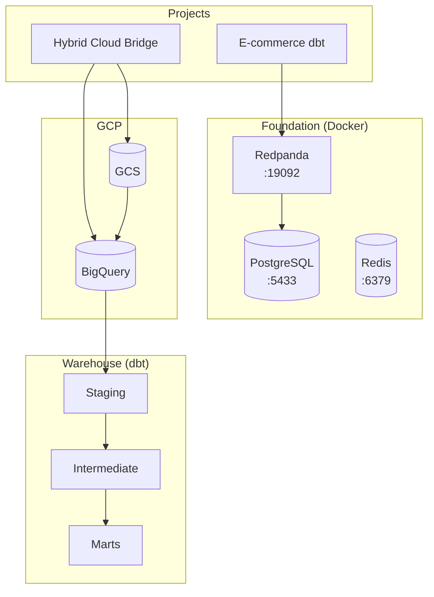
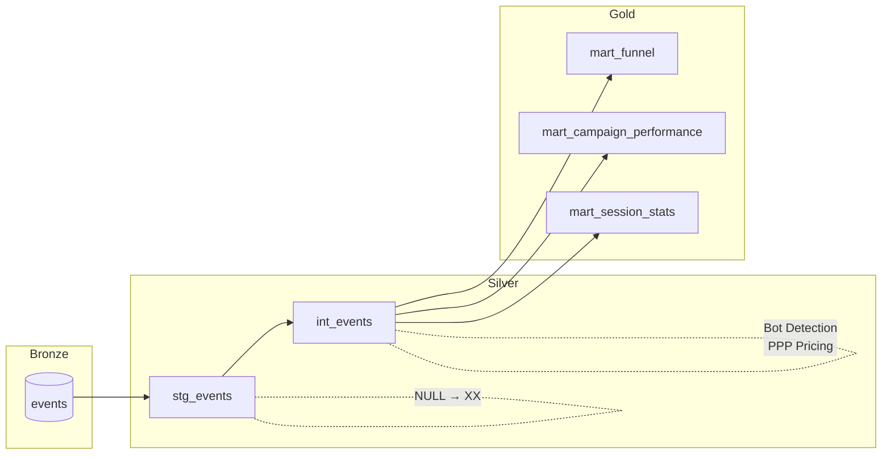
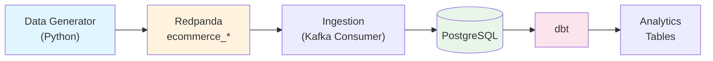
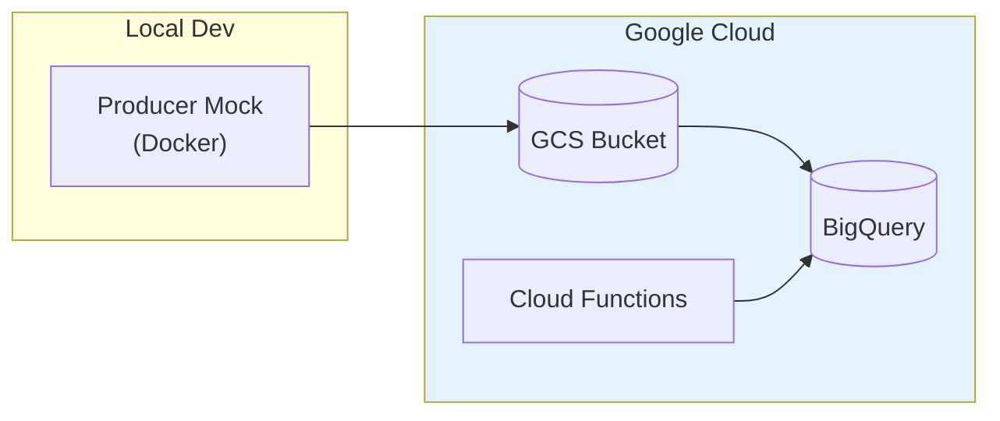

# Data Platform Portfolio

**Multi-Project Data Engineering Portfolio** by Rafael Ortiz

A production-ready data engineering portfolio showcasing real-world data platform patterns, built on a shared infrastructure foundation with fully-functional end-to-end projects.

---

## 🎯 Portfolio Structure

```
data-platform/
├── foundation/              # Shared infrastructure (Docker services)
│   ├── docker-compose.yml   # PostgreSQL, Redpanda, Redis
│   └── shared/              # Reusable libraries (messaging, database, models)
│
├── warehouse/               # ✅ BigQuery + dbt Data Warehouse (COMPLETE)
│   └── models/
│       ├── staging/         # stg_events (country nullfix)
│       ├── intermediate/    # int_events (bot detection, PPP pricing)
│       └── marts/           # Analytics-ready tables
│
├── projects/                # Self-contained data engineering projects
│   ├── ecommerce-dbt/       # ✅ Local Redpanda/PostgreSQL pipeline
│   └── hybrid-cloud-bridge/ # ✅ GCP integration (BigQuery, Cloud Functions)
│
├── scripts/                 # Utility scripts for testing and verification
└── tests/                   # Unit and integration tests
```

### High-Level Architecture



---

## 🏗️ Foundation

**Shared Infrastructure** - Containerized services used by all projects

| Service | Purpose | Port | Web UI |
|---------|---------|------|--------|
| **PostgreSQL** | Data warehouse | 5433 | - |
| **Redpanda** | Kafka-compatible streaming | 19092 | [Console](http://localhost:8080) |
| **Redis** | Caching layer | 6379 | - |

### Multi-Tenant Design
Each project uses the same infrastructure with **namespace isolation**:
- ✅ Separate PostgreSQL databases per project
- ✅ Prefixed Kafka topics per project (`ecommerce_*`, `iot_*`, etc.)
- ✅ Prefixed Redis keys per project

📖 See [`foundation/README.md`](foundation/README.md) for architecture details.

---

## 📦 Warehouse (BigQuery + dbt)

> **Focus**: Enterprise Data Warehouse, Advanced Analytics, Self-Healing Pipelines

A production-grade dbt project designed for **Google BigQuery** implementing the Medallion Architecture.

### Data Model Layers

| Layer | Model | Purpose |
|-------|-------|---------|
| **Staging** | `stg_events` | Source normalization, NULL country → 'XX' |
| **Intermediate** | `int_events` | Business logic: Bot detection, PPP pricing, country backfill |
| **Marts** | `mart_funnel` | Conversion funnel: View → Click → Purchase |
| | `mart_campaign_performance` | Revenue breakdown by campaign, device, country |
| | `mart_session_stats` | Session-level metrics |

### Key Features

- **Self-Healing Data**: Automated backfill of corrupt country codes using Window Functions
- **Bot Detection**: Automated flagging of high-frequency sessions (>50 events/session)
- **Regional Pricing (PPP)**: Tier-based value adjustment (US/UK/DE/JP = 100%, BR/FR/CA = 50%, Others = 20%)
- **Campaign Hierarchy**: Extraction of campaign category from ID (`cmp_US_blackfriday` → `Blackfriday`)
- **Revenue Attribution**: Separate revenue streams for sales, clicks, and views

### Data Lineage



### Tech Stack
BigQuery, dbt, Python, GCS (Parquet)

---

## 📊 Projects

### 1. ✅ E-commerce Real-Time Stream (Local)

> **Focus**: Real-time event streaming, SQL transformations

**Architecture**:



**Components**:
- `data_generator/` - Synthetic e-commerce event generator
- `ingestion/` - Kafka consumer → PostgreSQL pipeline
- `storage/` - Database schemas and migrations

**Tech Stack**: Redpanda (Kafka), PostgreSQL, dbt, Python, Docker

📖 [View Project Details →](projects/ecommerce-dbt/README.md)

---

### 2. ✅ Hybrid Cloud Bridge (GCP Integration)

> **Focus**: Cloud data pipeline, GCP services integration

**Architecture**:



**Components**:
- Docker-based producer mock for local development
- GCP integration infrastructure
- BigQuery data ingestion

**Tech Stack**: Docker, GCP (BigQuery, Cloud Functions), Python

📖 See [`projects/hybrid-cloud-bridge/`](projects/hybrid-cloud-bridge/)

---

### 3. 🔜 IoT Real-time Dashboard (Planned)

> **Focus**: Real-time streaming analytics, Power BI dashboards

- IoT sensor data streaming
- Real-time analytics and aggregations
- Power BI live visualizations
- Monitoring dashboards

**Tech Stack**: Redpanda, PostgreSQL, Power BI, Python

### 4. 🔜 Financial Analytics Pipeline (Planned)

> **Focus**: Batch ETL processing, Tableau visualizations

- Financial transaction processing
- Batch ETL pipelines with SCD Type 2
- Tableau dashboards
- Regulatory reporting

**Tech Stack**: Redpanda, PostgreSQL, Tableau, Python

---

## 🚀 Quick Start (5 minutes)

### Prerequisites
- Docker Desktop installed and running
- Python 3.10+ with venv
- Git

### Start the Platform

```bash
# 1. Clone the repository
git clone <your-repo-url>
cd data-platform

# 2. Start infrastructure (PostgreSQL, Redpanda, Redis)
cd foundation
docker-compose up -d
cd ..

# 3. Set up Python environment
python -m venv venv
venv\Scripts\activate  # On Windows
source venv/bin/activate  # On macOS/Linux
pip install -r requirements.txt

# 4. Initialize the database
python scripts\init_database.py

# 5. Run the quality checks (optional)
scripts\run_checks.bat
```

🎉 **That's it!** Your data platform is ready.

### Quick Verification

```bash
# Check that all services are running
python scripts\check_services.py

# Access Redpanda Console
start http://localhost:8080
```

---

## 💡 Skills Demonstrated

### Infrastructure & Architecture
- Docker containerization
- Multi-tenant data platform design
- Namespace isolation patterns
- Infrastructure as Code (Docker Compose)

### Data Engineering
- Real-time event streaming (Kafka/Redpanda)
- Data ingestion pipelines
- Data warehousing (PostgreSQL, BigQuery)
- ETL/ELT patterns

### Analytics & BI
- **Enterprise Warehousing**: Google BigQuery, Partitioning, External Tables
- **Advanced dbt**: Custom Macros, Incremental Models, Window Functions
- **Marketplace Analytics**: Funnel Optimization, Bot Detection, PPP Pricing
- **SQL Analytics**: CTEs, Complex Joins, Aggregations
- **Visualization**: Power BI, Tableau, Looker Studio (planned)

### Software Engineering
- Modular architecture
- Code reusability (OOP Design Patterns)
- Resilience patterns (DLQ, Retries)
- Configuration management
- Testing and validation

---

## 🛠️ Development & Quality

### Quality Checks

Run comprehensive checks before committing:

```bash
# Windows
scripts\run_checks.bat

# macOS/Linux
chmod +x scripts/run_checks.sh && ./scripts/run_checks.sh
```

**What it tests:**
- ✅ **Black**: Code formatting
- ✅ **Flake8**: Linting and style
- ✅ **Pytest**: Unit and integration tests

### Pre-commit Hook (Recommended)

Automate quality checks on every commit:

```bash
# Windows (PowerShell)
@"
#!/bin/sh
scripts/run_checks.bat
"@ | Out-File -FilePath .git/hooks/pre-commit -Encoding ASCII

# macOS/Linux
cat > .git/hooks/pre-commit << 'EOF'
#!/bin/sh
./scripts/run_checks.sh
EOF
chmod +x .git/hooks/pre-commit
```

---

## Contributing

This is a portfolio project. Each project is self-contained and can be run independently.

---

## License

MIT

---

**Built for learning and demonstrating data engineering skills**
